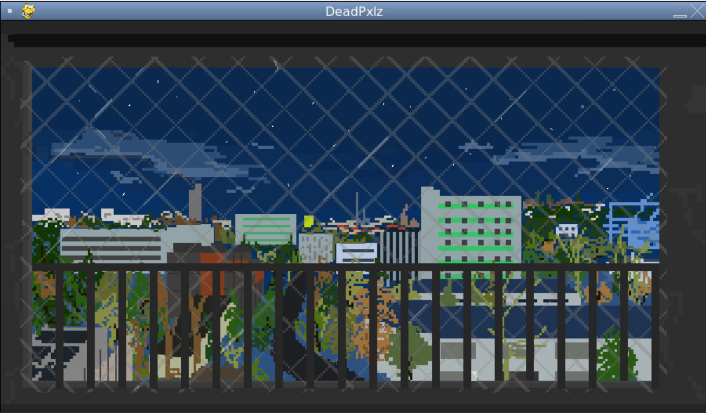

## Piotr Kubala

  

My name is Piotr Kubala and I am a student of Computer Science (Informatyka i Systemy Inteligentne) at AGH University of Science and Technology in Kraków (Poland).

## Projekt na przedmiot Narzędzia Informatyczne
Celem projektu było stworzenie prostej gry platformowej o grafice inspirowanej takimi grami jak Terraria lub Mario. Praca nad projektem przyczyniła się przede wszystkim do zwiększenia naszych umiejętności pracy w zespole oraz poznaliśmy nowe narzędzia ułatwiające tworzenie oprogramowania w grupie.

  

### Linki do stron członków naszego zespołu

* (Patryk Knapek)[https://razogarz.github.io/]
* (Tomasz Makowski)[https://makowskitomasz.github.io/]
* (Maciej Pawłowski)[https://maciekpawlowski1.github.io/]
* (Katarzyna Stępień)[https://stepkata.github.io/]
* (Wojciech Neuman)[https://wojciechneuman.github.io/]
